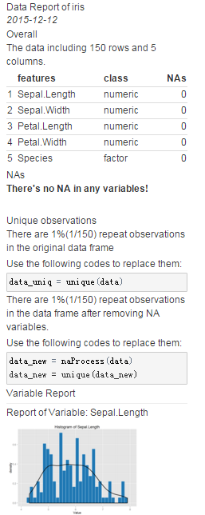

## Crate a Data Report from preReport pacakge

`preReport` is a R package creates data report before modeling which is useful for looking though the data.


Install this package by:


```
devtools::install.packages("lchiffon/preReport")
library(preReport)
preReport(iris)
```
Here's a quick look to the report of Iris data.


